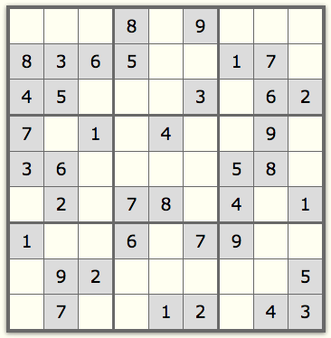

SUDOKU CHALLENGE
=====

#####*Currently in progress*

## Sudoku Rules

If you never played Sudoku, the good news is that the rules are simple. You start with a 9 by 9 grid divided in 9 boxes.

The goal of the game is to fill out the entire grid with numbers. The trick is that every row, every column and every box must have all nine digits 1 to 9. That is, if row 1 in this example already has digits 8 and 9, they can't be used in the same row anymore. You can practice playing it at [sudoku9x9.com](http://www.sudoku9x9.com/?level=1).

A challenge to solve an easy sudoku, progressing to solving harder puzzles.
